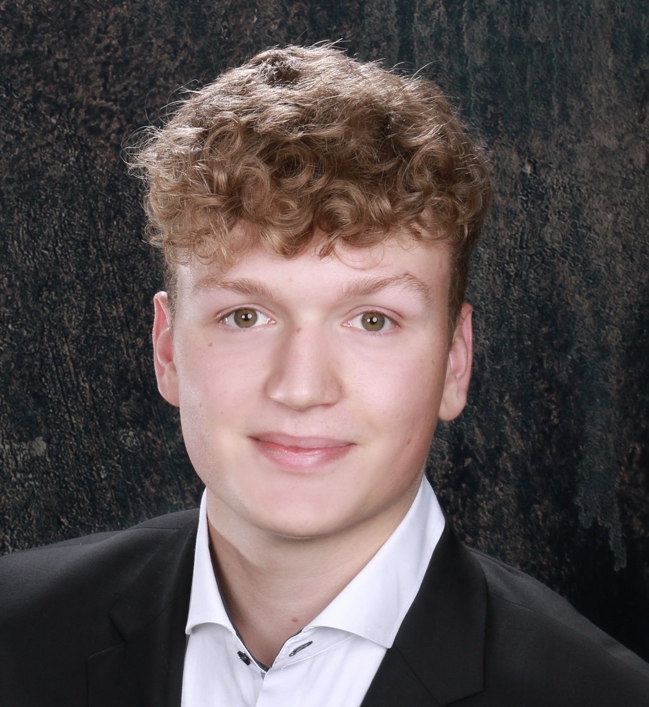
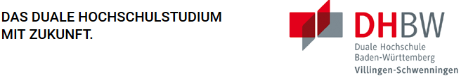

# 👋 Hi, I'm Menko

I am a 21-year-old international student from Germany currently pursuing a dual study program in **Business Informatics** at the: 
> **DHBW Villingen-Schwenningen.**

I am completing the practical part of my studies at: 
> **Deloitte GmbH**

where I'm actively involved in projects combining technology and business processes. 

## 🔖 Structure

[What I do](#what-I-do)\
[Education](#education)\
[International Background](#international-background)\
[Interest & Skills](#interest--skills)\
[My Socials](#my-socials)\

## 🎟️ What I do

As a programmer, I'm passionate about developing Applications and improving my knowledge. To learn I took different online Programming courses:
- [x] Harvard CS50: Introduction to Computer Science
- [x] iOS & Swift - The Complete iOS App Development Course
- [ ] ISC2 - Certified in Cybersecurity

## 🎓 Education

1. _IGS Flötenteich Oldenburg_
2. _DHBW Villingen-Schwenningen_
3. _University of California San Diego_

## 🌐 International Background

Being an international student allows me to bring a diverse perspective to my work, embracing cross-cultural collaboration and communication in all projects.

## 💡 Interest & Skills
- **Programming:**
  -  `Python`
  -  `SQL`
  
- **Soft skills:** 
  - Teamwork 
  - Problem-solving
  - Fotos [(My Favourite Picture)](IMG_9638_jpg.JPG)

### 📮 My socials

[LinkedIn](https://www.linkedin.com/in/menko-hornstein/)\
[GitHub](https://github.com/xVeradus)

